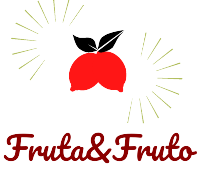

# site-fruta-e-fruto

O site Fruta&amp;Fruto foi desenvolvido no curso "Bootstrap 4: Criando uma landing page responsiva" oferecido pela Alura. Se trata de um site para encontrar e até mesmo adicionar (em andamento) receitas naturais. No curso, não houve a utilização de Javascript, porém estou adicionando novas funcionalidades.

Desenvolvido com:

   

 
  

Será utilizado para features futuras:

